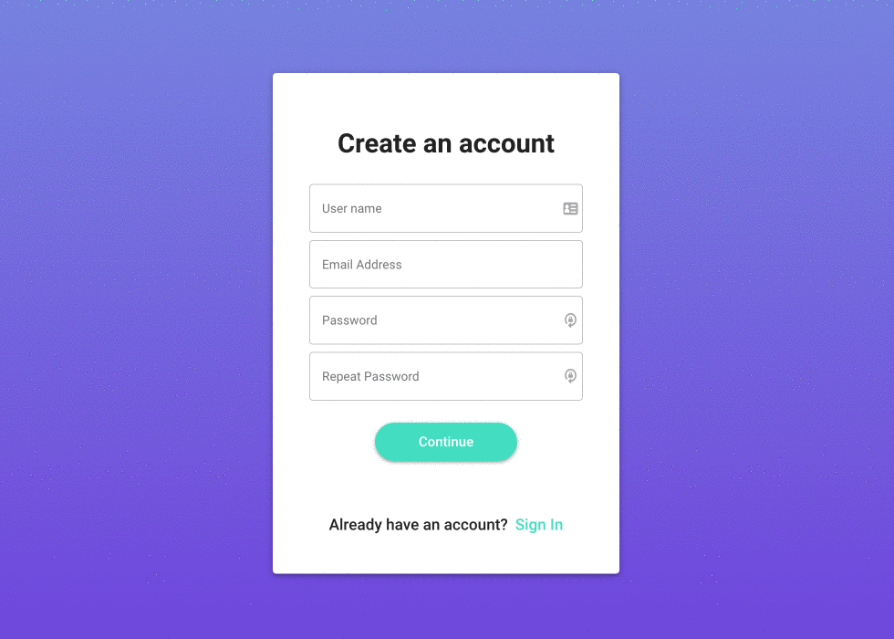

# Peer Code Review App

> A web app that matches programmers to a mentor to review their code.

## Demo

Try Peer Code Review Applicaiton immediately using your phone or laptop at [peercodereview.herokuapp.com](peercodereview.herokuapp.com)!

## About

A web app that matches programmers to a mentor to review their code. Programmers earn credits by giving code reviews, and you can spend credits on getting your code reviewed (by someone a level up from you).

### Who’s it for?

Programmers who are looking for a mentor to provide code feedback!

### User Journey

Context: I’m a bootcamp grad and I’m new to the field! To improve my coding skills, I want to get feedback from people more experienced than me to make sure I’m following best practices and learn where I can improve.

I sign on to the platform and create an account. I input my details in my profile (i.e. beginner with <1 year of work experience).

I begin with 3 credits (1 credit = 1 code review)

I upload a snippet of my code with context around what I’m writing to submit for review.

In some time I get a notification that someone has reviewed my code and I can review their notes!

---

## Table of Contents

- [Peer Code Review App](#peer-code-review-app)
  - [Demo](#demo)
  - [About](#about)
    - [Who’s it for?](#whos-it-for)
    - [User Journey](#user-journey)
  - [Table of Contents](#table-of-contents)
  - [Installation](#installation)
    - [Running MongoDB locally](#running-mongodb-locally)
    - [Running Redis locally](#running-redis-locally)
  - [Features](#features)
      - [Login/sign up flow with e-mail address](#loginsign-up-flow-with-e-mail-address)
      - [Create profile (OnBoard page)](#create-profile-onboard-page)
      - [Buy credits](#buy-credits)
      - [Rich text editor with real time code highlighting](#rich-text-editor-with-real-time-code-highlighting)
      - [Notifications center](#notifications-center)
      - [JWT authentication](#jwt-authentication)
      - [Instant messages with Sockets.io](#instant-messages-with-socketsio)
      - [Upload code](#upload-code)
      - [Receive code review](#receive-code-review)
      - [Send code review](#send-code-review)
      - [Upload projects to show](#upload-projects-to-show)
      - [Mobile ready](#mobile-ready)
  - [Usage](#usage)
  - [Technologies (STACK)](#technologies-stack)
  - [Team](#team)
  - [FAQ](#faq)
  - [Support](#support)

## Installation

If you want to run Peer Code Review application locally, use the `dev` branch. For deployment use `master` branch.

### Running MongoDB locally

1. Go to [MongoDB](https://docs.mongodb.com/manual/installation/)
2. Follow instructions on installing MongoDB Community
3. Run MongoDB server from terminal
4. Connect to local url: mongodb://localhost:{DEFAULT_PORT=27017}/{LOCAL_DB_NAME}

### Running Redis locally

1. On terminal, install [Homebrew](https://brew.sh/)
2. Run `brew install redis`
3. Start redis service `brew services start redis`
4. Run redis server `redis-server`
5. To check if redis server is running, enter `redis-cli ping` and command line will output `PONG`
6. Stop redis server by pressing **CONTROL+C**
7. Stop redis service `brew services stop redis`

## Features

#### Login/sign up flow with e-mail address

Validation proof on front-end and back-end. Regex used to check validity of password, email and login data.

#### Create profile (OnBoard page)

Specify your skill level at any of the presented programming languages. Page is fully responsive with advanced logic behind the scenes.

#### Buy credits

User can buy credits with built-in [Stripe](https://stripe.com) payment system. For testing purposes use test card number `4242 4242 4242 4242` and any `CVV` code.

#### Rich text editor with real time code highlighting

Rich text editor is build on top of [Draft.js](https://draftjs.org/) project improved with newly developed and implemented real-time code highlighting with [Prism.js](https://prismjs.com/).

#### Notifications center

Every time an event happen in the application user will get a notification on what happened, e.g. 'New message' or 'You have a new review'.

#### JWT authentication

JWT (JSON Web Token) is a compact and self-contained mechanism for transmitting data between front and server in a way that can be verified and trusted because it is digitally signed and passed over HTTP.

#### Instant messages with Sockets.io

When discussing code users are incentivised to use real-time message sharing with [Sockets](http://sockets.io). All messages can contain perfectly highlighted code with our newly built [Rich text editor with real time code highlighting](#rich-text-editor-with-real-time-code-highlighting).

#### Upload code

With a `Code Upload` dialog Upload a code snippet for more advanced programmers to review. This will cost user 1 credit that can be earned later with topping up the balance or giving reviews on the code of other developers.

#### Receive code review

Get valueble advice on how code works or doesn't work, how to improve its time and space complexity, appropriate use of algorithms and etc.

#### Send code review

Help other users to improve their skills with the Peer Code Review project. Accept request and give thoughtfull review on the code, posted by other developers and get rewards. You will get +1 credit for every accepted and finished review.

#### Upload projects to show

User can add any coding projects to their profile page to share them with others and maybe discuss better code solutions to improve them.

#### Mobile ready

Application is fully responsive on any screen sizes and devices such as laptops, phones or tablets. To improve user experience mobile [Material-UI](https://material-ui.com) components were used.

## Usage

You can find app deployed on Heroku.com [peercodereview.herokuapp.com](https://peercodereview.herokuapp.com). For a demo run use **_Guest_** login. This will allow to have a virtual tour inside the Peer Code Review Application.

## Technologies (STACK)

- JavaScript
- React with Hooks
- MongoDB
- Node.js
- Express.js
- Redis
- Sockets.io
- Material-UI
- JWT auth

## Team

> Team of developers worked on the Peer Code Review App

|               <a href="http://fvcproductions.com" target="_blank">**Vitalii Sidorok**</a>                |               <a href="http://fvcproductions.com" target="_blank">**Affeeq Ismail**</a>                |                  <a href="http://fvcproductions.com" target="_blank">**Tyler Poore**</a>                  |
| :------------------------------------------------------------------------------------------------------: | :----------------------------------------------------------------------------------------------------: | :------------------------------------------------------------------------------------------------------: |
|  |  |  |
|               <a href="http://github.com/svitaly" target="_blank">`github.com/svitaly`</a>               |              <a href="https://github.com/Affeeq" target="_blank">`github.com/affeeq`</a>               |          <a href="http://github.com/LiveBacteria" target="_blank">`github.com/LiveBacteria`</a>          |

## FAQ

- **Do we need a FAQ section?**
  - I included all sections I could come with. Feel free to delete or modify any of them.

## Support

Reach to any of the team members at one of the following places:

- Vitalii Sidorok at <a href="http://github.com/svitaly" target="_blank">`github.com/svitaly`</a>
- Affeeq Ismail at <a href="https://github.com/Affeeq" target="_blank">`github.com/affeeq`</a>
- Tyler Poor at <a href="http://github.com/LiveBacteria" target="_blank">`github.com/LiveBacteria`</a>

---

Copyright 2020 © <a href="https://github.com/hatchways/team-blueberry" target="_blank">Team Blueberry</a>.
